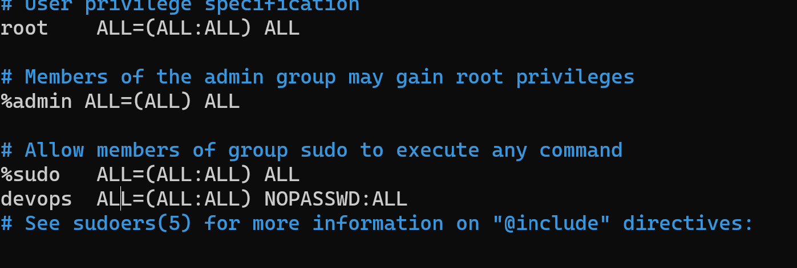
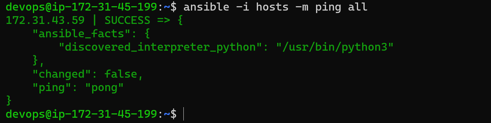
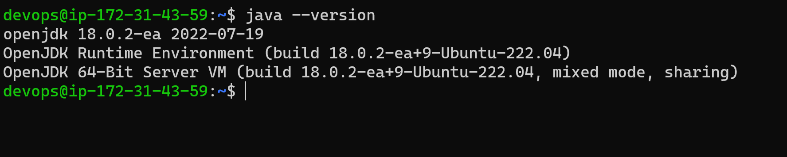

## INSTALL NGNIX ,DOTNET, JAVA THROUGH  ANSIBLE CONTROL NODE
---

###step to perform
 1. Create two  ubuntu vm's
 2. Enable the passwd authentication
   ```
   sudo vi /etc/ssh/sshd_config
   ```
   

  3. Restart the sshd service 
   
   

   4. Now create a user "devops" on both the instance
   
   

  5. Give sudo permissions to the users on both the instances



  6. Now login with devops user on both the instance
   

  7. Now create ssh_keygen on control node
  8. Now copy id  of the control node to the node1 by giving the private ip adress of node1
   


   ### NOW WE HAVE CONNECTED BOTH THE MACHINES

   9.  To check the create a hosts file with node1 private ipadresses and run the command
```
ansible -i hosts -m ping
```
it will give some output which looks like this in below



### NOW INSTALL ANSIBLE IN CONTROL NODE IN DEVOPS

```
sudo apt update
sudo apt install software-properties-common -y
sudo add-apt-repository --yes --update ppa:ansible/ansible
sudo apt install ansible -y
```


###  INSTALLING JAVA USING ANSIBLE

  1. Create two directories named as inventory playbooks
  2. In inventory create hosts file and give node1 private ip adresses
  3. In the playbooks directory write a play installing java
   
   

   


  4. Now run the command 
   ```
   ansible-playbook -i <inventory_path> <playbooks_path>
   ````
   ### NOW WE WILL SEE OUTPUT LIKE THIS
    

 
  Now check java version in node1




   ### INSTALLING DOTNET AND NGINX

1.  In the playbooks directory write a play installing nginx and dotnet
2. Now run the command 
   ```
   ansible-playbook -i <inventory_path> <playbooks_path>
   ````
3. Now we will see output like this

   .png)

   ### NOW CHECK THE NODE1 SEE THE THE INSTALLATIONS
     
     .png)


     

   
 
